# The Ultimate EV Mapper

Welcome to the repository for "The Ultimate EV Mapper". This project showcases the functionalities and features of our EV mapping application, developed as part of our coursework at the University of Toronto.

## Table of Contents

- [Introduction](#introduction)
- [Project Vision](#project-vision)
- [Path Finding](#path-finding)
- [Input Validation](#input-validation)
- [Special Features](#special-features)
- [The Travelling Courier](#the-travelling-courier)
- [Comparisons and Future Plans](#comparisons-and-future-plans)
- [Conclusion](#conclusion)
- [References](#references)

## Introduction

The Ultimate EV Mapper is designed to provide comprehensive navigation for electric vehicle users. Our project aims to enhance the navigation experience by integrating various features such as real-time data, optimized pathfinding, and user-friendly interfaces. Below are some slides from our final presentation that highlight key aspects of the project.

## Project Vision

Our vision for the Ultimate EV Mapper includes providing users with precise navigation, real-time data integration, and various special features that set our app apart from existing solutions.

## Path Finding

### Algorithms

Our pathfinding algorithm is based on the A* search algorithm, which provides efficient and optimal routing. The algorithm was implemented in milestone 2, which expands on the basic functionalities set up in milestone 1.

#### Why A*?

The A* algorithm is chosen for its efficiency and accuracy in finding the shortest path. It combines the strengths of Dijkstra’s algorithm and a heuristic approach to estimate the shortest path to the destination. While Dijkstra’s algorithm explores all possible paths equally, A* uses heuristics to prioritize paths that are more likely to lead to the goal, significantly reducing computation time.

#### How A* Works

A* operates by maintaining a priority queue of nodes to explore, prioritizing them based on their total estimated cost (`f(n) = g(n) + h(n)`), where:
- `g(n)` is the cost from the start node to node `n`.
- `h(n)` is the heuristic estimated cost from node `n` to the goal.

The algorithm continuously expands the most promising node until it reaches the goal, ensuring the shortest path is found.

WaveElem                   |  A* Search
:-------------------------:|:-------------------------:
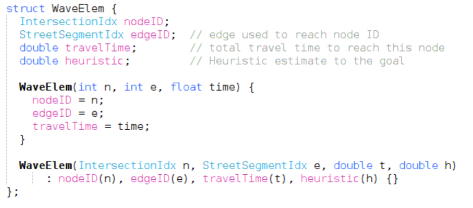  |  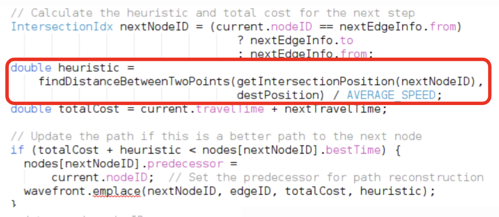

#### Path Finding 
Pathfinding is a critical feature of the Ultimate EV Mapper, enabling users to find the most efficient routes between two points. Our pathfinding algorithm is primarily based on the A* search algorithm, known for its efficiency and accuracy in determining the shortest path. In scenarios where heuristic information might not be available or accurate, we also implement Dijkstra’s algorithm to ensure robustness.

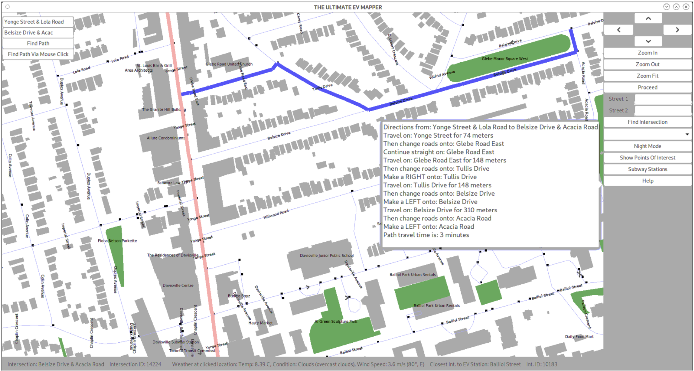  

### Dijkstra’s Algorithm

While A* is the primary algorithm used, we also implemented Dijkstra’s algorithm for scenarios where the heuristic information might not be available or accurate. Dijkstra’s algorithm ensures we can still find the shortest path by exploring all possible routes equally, which can be useful in more complex routing scenarios like the Travelling Courier problem.

### Methods of Input Validation

We implemented several methods to ensure user inputs are valid and provide helpful feedback when they are not. These methods are crucial for a smooth user experience and are handled within `m2.cpp`.

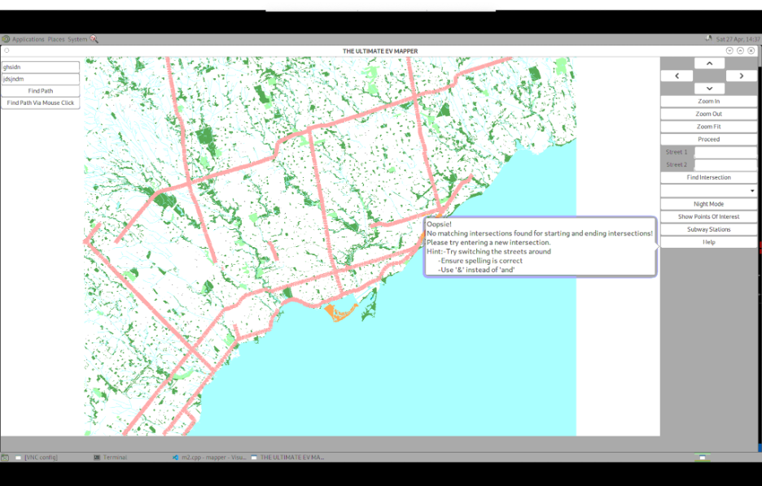  
*Entry warning for Invalid Street Intersection Names*  

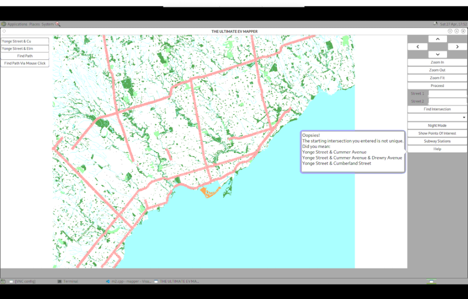  
*Autocomplete suggestions when a partial street intersection name is entered*  

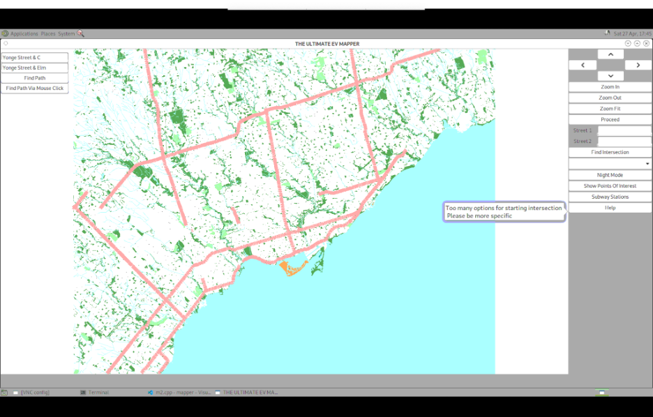  
*Error message for multiple street intersections*  

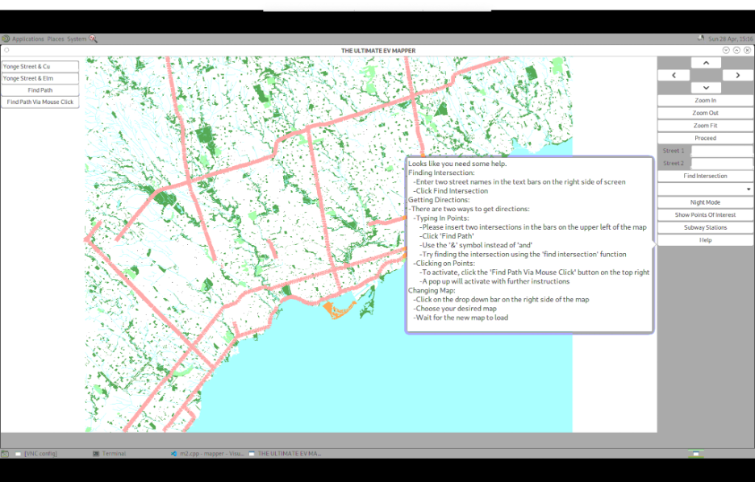
*Instructions given when help button is clicked*

## Special Features

### Closest EV Charging Station

One of our key features is locating the nearest EV charging station based on the user's current location or input. This feature is integrated within `m3.cpp`, which focuses on real-time data integration.

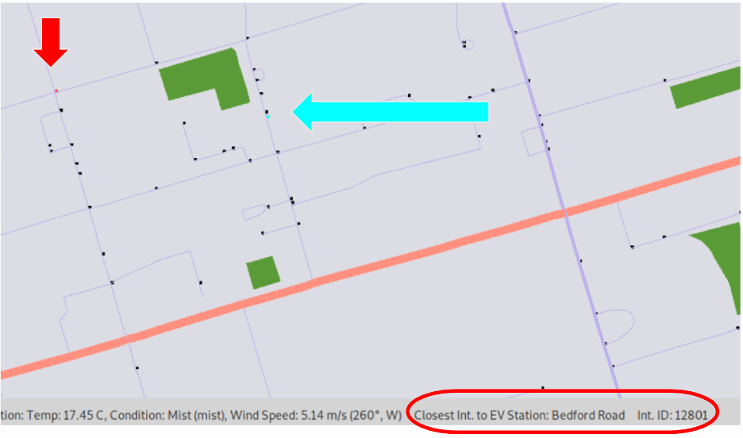  
*Visual of closest EV station and highlighted intersection*  

### Live Wind Speed and Direction

The app provides live updates on wind speed and direction, which can be crucial for planning EV trips. This functionality is also part of the real-time data integration handled in `m3.cpp`.

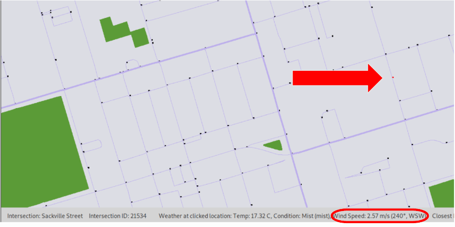  
*Visual of wind speed and direction near highlighted intersection*  

### Live Weather Conditions

Real-time weather conditions are integrated into the map to help users plan their journeys better. This feature is implemented in `m3.cpp`.

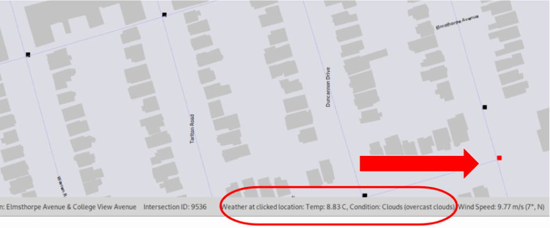  
*Visual of wind speed and direction near highlighted intersection*  

### Points of Interest

Users can view categorized points of interest along their routes, enhancing the travel experience. This feature, implemented in `m3.cpp`, adds an extra layer of utility for users.

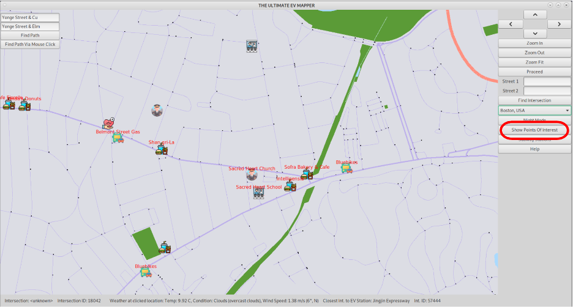  
*Points of Interest Categorized And Displayed*  

## The Travelling Courier

We implemented a multi-Dijkstra algorithm for the travelling courier feature, which optimizes multiple delivery routes simultaneously. This complex feature is handled in `m4.cpp` and `m4_new.cpp`.

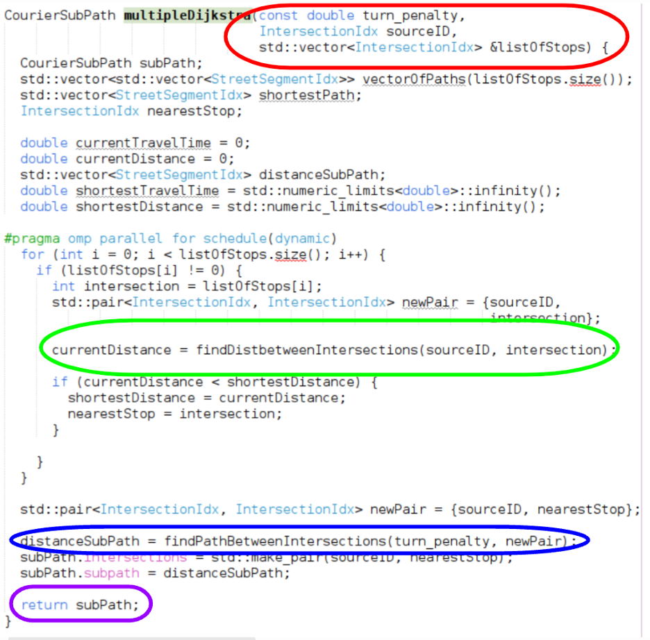  
*Code snippet of multi-Dijkstra algorithm*  

## Comparisons and Future Plans

### Algorithm Comparisons

We compared our pathfinding algorithms with those used by competitors like Google Maps and Waze. The comparison highlights the strengths of our approach, particularly in terms of EV-specific features.

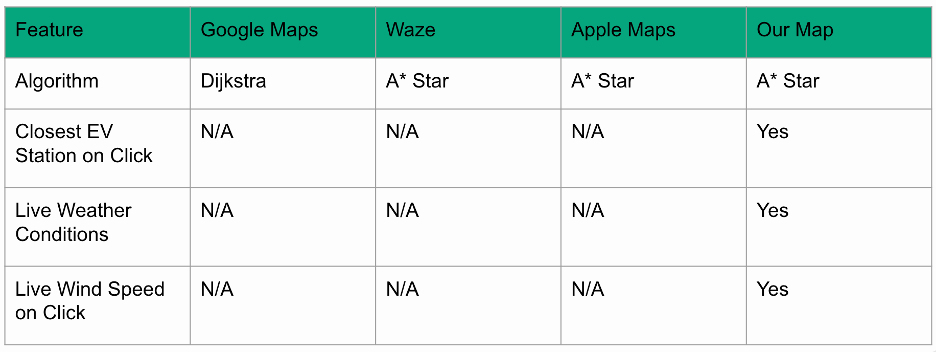  
*Comparison table between our competitors and our map*  

### Future Plans

Our future plans include integrating more real-time data sources and improving user interaction features. We aim to address four major gaps identified during the project:

1. **EV Station Details**: Enhance the details provided for EV stations, similar to PlugShare.
2. **Live Traffic Data**: Integrate live traffic data, akin to Waze.
3. **POI Reviews**: Incorporate reviews for points of interest, similar to Google Maps.
4. **Crowd Sourced Data**: Use crowd-sourced data to provide information on speed cams, construction, and other road conditions.

## Conclusion

The Ultimate EV Mapper aims to revolutionize the way electric vehicle users navigate and plan their trips by providing real-time data, accurate routing, and a host of additional features to enhance the user experience.

## References

For a complete list of references and further reading, please see the last page of the PDF.

Thank you for visiting our repository!
